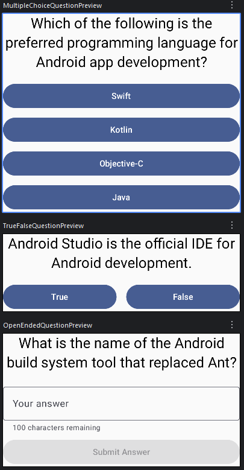
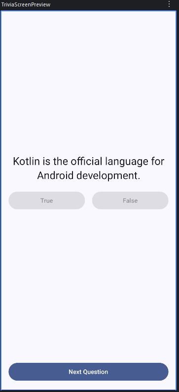

# Android Technical Interview Take Home Challenge

## Table of Contents
- [Welcome](#welcome)
- [Quiz App Challenge](#quiz-app-challenge)
- [Visual Guide](#visual-guide)
- [Guidance for Success](#guidance-for-success)
  - [Core Requirements](#core-requirements)
  - [Opportunities to Excel](#opportunities-to-excel)
- [Submitting Your Work](#submitting-your-work)

## Welcome
We're glad you're taking the time to interview with Cricut! This take-home challenge is an opportunity for you to showcase your Android development skills. Please feel free to use the resources you'd typically rely on in your day-to-day work. We encourage you to research, experiment, and enjoy the process.

## Assessment Overview
This challenge involves building a small Android quiz application. The primary goal is to assess your approach to application architecture, UI implementation with Jetpack Compose, and state management within the Android ecosystem.

**Key Steps:**
1.  **Fork** the provided repository to your personal GitHub account.
2.  **Verify Initial Setup:** Ensure the forked repository builds and runs correctly in Android Studio. The initial state of the repository should display a basic placeholder or "hello world" screen.
3.  Implement the quiz app features detailed in the "Quiz App Challenge" section below, starting from the verified base state.
4.  When finished, submit a link to your forked repository (please do not create a pull request).

## Quiz App Challenge

Your task is to develop a small Android application using Android Studio. Please implement the code within your **fork** of the provided repository, adhering to these specifications:

- **Shareability:** Your project must be accessible via a public GitHub repository.
- **Technology Stack:** Utilize Jetpack Compose and Material3. Employ a consistent MVVM architectural pattern throughout the project.
- **Scope:** The goal is to demonstrate your approach to building a Compose application and your architectural choices. You do *not* need to implement API clients or prepare the app for a production release.
- **Functionality:** Create a 'Quiz App' that presents **two** distinct question types chosen from the following options:
    - A true/false question.
    - A multiple-choice question (4 options, single correct answer).
    - A multiple-selection question (4 options, multiple correct answers allowed).
    - An open-ended question requiring a typed text response.
- **User Flow:**
    - The app can use either a *single screen* that displays one question at a time, or *two separate screens* (one for each question). Simple content replacement is sufficient; **visual transition animations are not expected/required.**
    - The questions should be Android-themed (e.g., "True or False: A Composable function can return a value?").
    - Display one question at a time.
    - Allow the user to select/input an answer for the first question and navigate to the second.
    - Enable navigation back from the second question to the first, preserving the user's previous answer selection.
    - Answer validation is *not* required.
- **Technical Considerations:**
    - Ensure the app gracefully handles configuration changes (like screen rotation) and lifecycle events (like the app being sent to the background).
    - Implement navigation between questions using a 'Next' button or a similar intuitive pattern.

## Visual Guide
These mock-ups illustrate one possible look for the app. Your design doesn't need to match; they are intended as a visual aid to help conceptualize the expected outcome.

- 
- 

## Guidance for Success

### Core Requirements
To meet the minimum expectations, please ensure your submission includes:

- **Compose UI:** Implement screen(s) (named `AssessmentScreen` in the project structure), allowing seamless forward and backward navigation between two questions, maintaining state upon return.
- **State Management:** Utilize a ViewModel to manage the UI state effectively.
- **Robustness:** Confirm the application handles configuration and lifecycle changes without issues.
- **Data Modeling:** Define appropriate data models for quiz questions and state management.

### Opportunities to Excel
While fulfilling the core requirements is sufficient, we value candidates who demonstrate a deeper understanding and initiative. Consider these suggestions (entirely optional) to further showcase your skills:

- **Asynchronous Operations:** Implement a mock repository to simulate data fetching.
- **User Experience:** Add features like a "quiz complete/restart" screen, answer validation, progress indicators, or input validation for text fields.
- **Navigation:** Use Jetpack Navigation or Compose Navigation for multi-screen implementations.
- **UI Polish:** Conditionally enable navigation/submission buttons based on user interaction.
- **Quality:** Include unit tests to verify your logic.

Our technical leads appreciate strong engineering skills and the ability to discuss the design choices and rationale behind your code.

## Submitting Your Work
Once you've completed the challenge, please email the link to your **forked** GitHub repository to your Cricut point of contact. **Please do not create a pull request against the original repository.**

Our technical team will review your submission, and we will follow up with you regarding the next steps.

If you have any questions during the process, don't hesitate to reach out. We look forward to seeing your work and discussing it with you!
